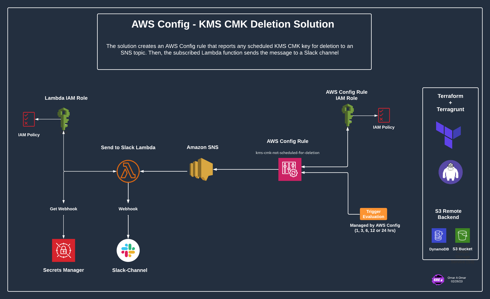
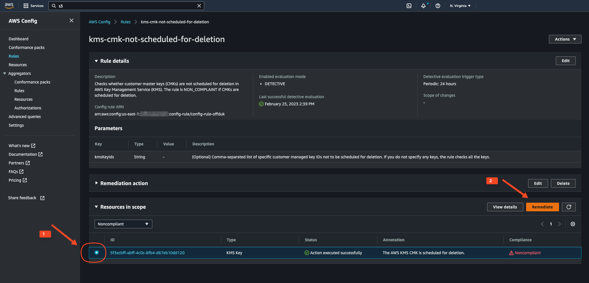

# AWS Config Rule to Report Scheduled KMS CMK Key Deletion to Slack

###  Table of Contents
<!-- TOC -->
- [Overview](#overview)
- [Architecture](#architecture)
- [How to deploy the solution](#how-to-deploy-the-solution)
  - [Prerequisites](#prerequisites)
  - [Initial Steps](#initial-steps)
  - [Deploy the solution using Terraform (local backend or S3 remote state backend)](#deploy-the-solution-using-terraform-local-backend-or-s3-remote-state-backend)
  - [Deploy the solution using Terragrunt](#deploy-the-solution-using-terragrunt)
- [Conclusion](#conclusion)
- [References](#references)
<!-- /TOC -->


## Overview

The solution creates an AWS Config rule that reports any scheduled KMS CMK key for deletion, and the rule is triggered to evaluate the configuration item when a KMS CMK key is scheduled for deletion. The evaluation schedule is managed by AWS Config rule. We have the option to configure the rule to trigger the evaluation every 1, 3, 6, 12 or 24 hours. When the rule is triggered and KMS CMK scheduled for deletion is identified, it sends a notification to an SNS topic including a predefined message. Then, the subscribed Lambda function to the SNS topic sends a notification to a Slack channel. The Lambda function obtains the Slack webhook URL from AWS Secrets Manager and sends a warning message to the specified Slack channel. If the rule is still non-compliant after the evaluation schedule, the rule sends a notification to the SNS topic again based on the evaluation schedule. 

The benefit of this solution is not only to report the scheduled KMS CMK key deletion to Slack, but also to provide the knowledge and experience on how to create an AWS Config rule to evaluate the configuration item for other AWS resources. Therefore, you can use the same approach to create an AWS Config rule to evaluate the configuration item for other AWS resources.

## Architecture

The solution creates the following resources:

1. AWS Config rule to evaluate the configuration item when a KMS CMK key is scheduled for deletion
2. AWS Config IAM role to allow AWS Config to use AWS Systems Manager document to evaluate the configuration item
3. AWS SNS topic to send a notification to the subscribed Lambda function
4. AWS Lambda function to send a notification to a Slack channel
5. AWS Lambda IAM role to allow the Lambda function to send a notification to a Slack channel and to get the Slack webhook URL from AWS Secrets Manager
6. AWS CloudWatch Logs log group to store the Lambda function logs
7. AWS Secrets Manager secret to store the Slack webhook URL (created using AWS CLI)




---

## How to deploy the solution

### Prerequisites

1. AWS CLI installed on your local device
2. AWS credentials configured on your local device
3. Slack webhook URL
4. AWS Config enabled in the AWS account

---

### Initial Steps

1. Clone the repository to your local device
2. Create a Slack webhook URL and store it in AWS Secrets Manager using the following AWS CLI command:

```
aws secretsmanager create-secret \
--name slack/sre-notifications \
--description "Slack webhook to send messages to Slack" \
--secret-string "https://hooks.slack.com/services/XXXXXXXXXXXXXXX" \
--region us-east-1 
```

Notes: 

- Replace the Slack webhook URL with your own Slack webhook URL.
- Keep the secret name as slack/sre-notifications as it is used in the Lambda function. If you want to use a different secret name, you need to update the `SecretId` in the Lambda function code (line 17).


### Deploy the solution using Terraform (local backend or S3 remote state backend)

1. Navigate to `aws_config_rule_module` directory
2. Update the `terraform.tfvars` file with the following values:

```
parameter_message  = "WARNING: A KMS CMK is scheduled for deletion"
evaluation_period  = "TwentyFour_Hours"
region             = "us-east-1"
```

Notes:

- `parameter_message` is the message that will be sent to the Slack channel. You can update the message as per your requirement.
- `evaluation_period` is the evaluation schedule for the AWS Config rule. The available options are `One_Hour`, `Three_Hours`, `Six_Hours`, `Twelve_Hours` and `TwentyFour_Hours`.
- `region` is the AWS region where the solution will be deployed.

3. Run the following commands to deploy the solution:

```
terraform init
terraform plan
terraform apply
```

4. Navigate to the AWS Config console and verify that the AWS Config rule is created and is in `COMPLIANT` state. To test the solution, you can schedule a KMS CMK key for deletion and verify that the AWS Config rule is in `NON_COMPLIANT` state and the Slack channel receives a notification.

5. Using S3 remote state (optional):

If you want to configure S3 remote state, you need to create an S3 bucket and DynamoDB table to store the Terraform state and lock the state file. You can use the following AWS CLI commands to create the S3 bucket and DynamoDB table:

- Create an s3 bucket and block public access:

```
aws s3api create-bucket \
--bucket terraform-state-bucket-0987654321 \
--region us-east-1
```

- Block public access to the S3 bucket:

```
aws s3api put-public-access-block \
--bucket terraform-state-bucket-0987654321 \
--public-access-block-configuration "BlockPublicAcls=true,IgnorePublicAcls=true,BlockPublicPolicy=true,RestrictPublicBuckets=true"
```

Note:
The S3 bucket name must be unique across all existing bucket names in Amazon S3. Replace the bucket name with your own bucket name and make sure that the bucket name is unique.


- Create on demand billing mode for the DynamoDB table:

```
aws dynamodb create-table \
--table-name terraform-state-lock \
--attribute-definitions AttributeName=LockID,AttributeType=S \
--key-schema AttributeName=LockID,KeyType=HASH \
--billing-mode PAY_PER_REQUEST \
--region us-east-1
```


- Create a `backend.tf` file in the `aws_config_rule_module` directory and update it with the following block and values:

```
terraform {
  backend "s3" {
    bucket = "terraform-state-bucket-0987654321"
    key    = "terraform.tfstate"
    region = "us-east-1"
    dynamodb_table = "terraform-state-lock"
  }
}
```

The `aws_config_rule_module` directory should now look like this:

```
|── backend.tf
├── main.tf
├── outputs.tf
├── terraform.tfvars
├── variables.tf
├── source ├── artifacts
           ├── function
           ├── policies
```


- Run the following commands to deploy the solution:

```
terraform init
terraform plan
terraform apply
```


### Deploy the solution using Terragrunt

1. Create a folder for the account, region or environment where you want to deploy the solution. For example, `dev` folder in the root directory as shown below:

```
├── README.md
├── dev
├── images
├── modules
└── terragrunt.hcl
```

2. Put the `aws_config_rule_module` folder in the `modules` folder.

3. Navigate to the `dev` folder and create a `terragrunt.hcl` file with the following content:

```
include {
  path = "${find_in_parent_folders()}"
}

terraform {
  source = "../modules/aws_config_rule_module"
}

inputs = {
  parameter_message  = "WARNING: A KMS CMK is scheduled for deletion"
  evaluation_period  = "TwentyFour_Hours"
  region             = "us-east-1"
}
```

Notes:

- `parameter_message` is the message that will be sent to the Slack channel. You can update the message as per your requirement.
- `evaluation_period` is the evaluation schedule for the AWS Config rule. The available options are `One_Hour`, `Three_Hours`, `Six_Hours`, `Twelve_Hours` and `TwentyFour_Hours`.
- `region` is the AWS region where the solution will be deployed.

4. On the root directory, create the `terragrunt.hcl` file with the following content:

```
remote_state {
  backend = "s3"
  config = {
    bucket  = "terraform-state-bucket-09876543212"
    key     = "environments/${path_relative_to_include()}/terraform.tfstate"
    region  = "us-east-1"
    dynamodb_table = "terraform-lock-table-09876543212"
  }
}

generate "providers" {
  path      = "providers.tf"
  if_exists = "overwrite"
  contents  = <<EOF
provider "aws" {
  region = "us-east-1"
  default_tags {
    tags = var.tags
  }
}
terraform {
  backend "s3" {
  }
}
EOF
}
```

Note:
- Replace the `bucket` and `dynamodb_table` values with your own S3 bucket and DynamoDB table names. The S3 bucket name must be unique across all existing bucket names in Amazon S3. Replace the bucket name with your own bucket name and make sure that the bucket name is unique.
- Replace the `region` value with your own AWS region.


5. Run the following commands to deploy the solution:

```
terragrunt init
terragrunt plan
terragrunt apply
```

6. Navigate to the AWS Config console and verify that the AWS Config rule is created and is in `COMPLIANT` state. To test the solution, you can schedule a KMS CMK key for deletion and verify that the AWS Config rule is in `NON_COMPLIANT` state and the Slack channel receives a notification based on the evaluation schedule.

If you want to trigger the AWS Config rule remediation manually (without waiting for the evaluation schedule), head over to the AWS Config console and click on the `Remediate` button. This will trigger the remediation action and the Slack channel will receive a notification. 



---


### Conclusion

In the post, we have seen how to utilize AWS Config rules to monitor the AWS resources for AWS KMS CMK keys that are scheduled for deletion. We have also learn how to remediate the AWS Config rule violations by sending a notification to a Slack channel. We can use the same approach to monitor and remediate other AWS Config rule violations.


---

### References

- [AWS Config](https://aws.amazon.com/config/)
- [AWS Config Rules](https://docs.aws.amazon.com/config/latest/developerguide/evaluate-config_use-managed-rules.html)
- [kms-cmk-not-scheduled-for-deletion](https://docs.aws.amazon.com/config/latest/developerguide/kms-cmk-not-scheduled-for-deletion.html)